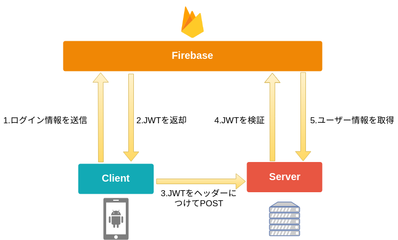

# Firebase Authorication、JWTって何？

## Firebase

### 概要
- FirebaseはMBaaS(Mobile Backend as a Service)の一つ。
- 認証やデータベース、ストレージ、プッシュ通知などモバイルアプリを作る上で必要なバックエンドの機能はほとんど揃っている。
- 今回の趣旨とは異となるが、FirebaseだけてサーバーレスでLineを作れるだけの機能がある。
- 現在はGoogleに買収されて、Google Cloud Platformとの連携もなされている。

### Firebase Authoricationとは
- Firebase AuthoricationはSNSログインやメールアドレスログインを一括して管理できるサービス。
- ユーザーの個人情報を自前で管理する必要がなくなる。
- iOS,Android,web(Javascript)のクライアントSDKや各言語のAdmin SDKが充実している。

## JWT

### 概要
- JWTはJSON Web Tokenの略。
- 電子署名付きのURL-safe(URLで使える文字しかない)なJSON。
- JWTの形式は{Base64エンコードされたヘッダ}.{Base64エンコードされた JSON の中身}.{電子署名}

### 署名付きってなんぞ
- 署名する際に使った鍵を使って、JSONが改ざんされてないかをチェックできる。
- ただし、Base64でエンコードされただけなので、中身は誰にでも見れる。(暗号化ではない。)
-

### 認証サーバーでの使い方
Firebase Authoricationを使った場合の手順は以下の通り。

1. クライアントが認証サーバーにidとパスワードを送る。
2. 認証サーバーでログインに成功すれば、user_id(unique)と有効期限を含めたJWTをクライアントに返す。
3. 認証が必要なサーバーサイドAPIを使いたいときには、JWTをヘッダーには入れてPOSTする。
4. サーバーサイドでは、送られてきたJWTを検証してから、レスポンスを返す。
(検証をパスしたということはJWTに含まれるuser_idが正しい=ログインしてると判断できる。)

